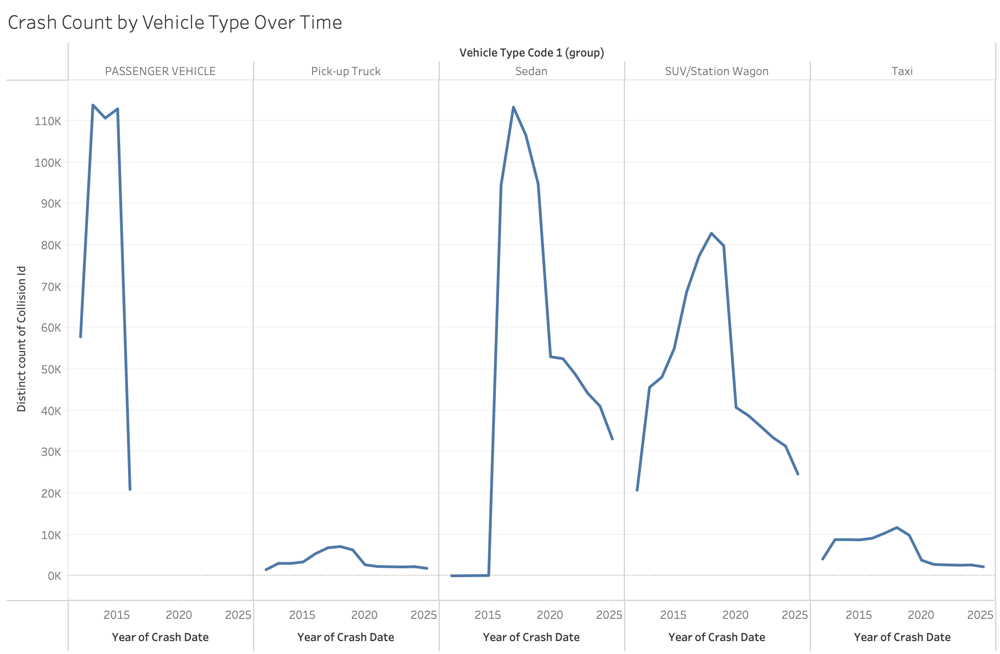

## uga-mist-group2-project2

## Group Members

Colin Meersman - cmm08294@uga.edu - https://github.com/colinmeersman-uga/uga-mist-group2-project2

Divya Kadiyala - dk94810@uga.edu - https://github.com/dk94810-lang/uga-mist-group2-project2

Aaron Silverman - abs87438@uga.edu - https://github.com/abs87438/uga-mist-group2-project2

Laiba Syed - ls76725@uga.edu - https://github.com/ls76725/uga-mist-group2-project2

Sanjot Bodake - ssb46835@uga.edu - https://github.com/sbodake1/uga-mist-group2-project2

## Objective
Identify a data set and based on the data set and phenomenon ask 2 questions that would highlight something interesting about the data or phenomenon. 

## Dataset Description
The dataset titled “Motor Vehicle Collisions - Crashes” was obtained from the U.S. government’s open data portal at data.gov. The dataset consisted of 1,048,576 rows and 30 columns, where each row corresponds to a single crash event, and each column represents a specific attribute of that event. For example, the date and time of the crash, the borough and ZIP code, geographic coordinates (latitude and longitude), street names, and counts of injuries or fatalities where the individuals were categorized as pedestrian, cyclist, or motorist. The dataset included contributing factors for up to five vehicles (driver inattention, unsafe speed, etc.). And vehicle types (Passenger Vehicle, Taxi, Bus, etc). Data types differed by column. Borough names and contributing factors as strings, geographical data as scientific numbers, and date and time as qualitative data. Essentially, this dataset assists the NYPD in supporting citywide traffic safety in New York, and our group in answering two very important questions.  

## Question 1

How have car crashes changed year over year in the different Boroughs?

Why is this important?

1. Identifies Local Trends and Problem Areas
Each borough has unique traffic patterns, infrastructure, and population density. Analyzing year-over-year changes helps pinpoint where crashes are increasing or decreasing, showing which areas may need more safety interventions or policy attention.

2. Measures the Effectiveness of Safety Initiatives
New York has implemented several traffic safety programs. Tracking changes by borough allows policymakers to evaluate whether these efforts are working in specific areas — for example, if crashes declined more in Manhattan than in Queens, it might suggest that certain local policies are more effective.

3. Reveals Impacts of Major Events or Conditions
Year-over-year data captures how external events — such as state-wide lockdowns, weather patterns, or infrastructure changes — affect crash rates.

This map shows the spatial distribution of car crashes across New York City’s five boroughs. Each borough is color-coded, helping visualize where incidents occur most frequently. This geographic overview sets the stage for analyzing how trends differ across areas and over time.

This line chart displays the total number of car crashes in New York City from 2013 to 2024. The data show a steady increase in crashes leading up to 2018–2019, followed by a sharp decline beginning in 2020. The dramatic drop corresponds with the onset of the COVID-19 pandemic, when lockdowns and reduced traffic volume significantly lowered crash counts. Although traffic gradually resumed in subsequent years, crash numbers have remained below pre-pandemic levels, suggesting a lasting shift in driving behavior or commuting patterns.

Before the pandemic, crash levels varied by borough but followed generally stable or slightly declining patterns. Brooklyn and Queens consistently reported the highest crash counts, reflecting their dense populations and extensive road networks. Manhattan and Staten Island showed gradual declines, possibly due to traffic-calming initiatives and enforcement of Vision Zero policies (An effort to have zero injuries or deaths in vehicle related incidents by prioritizing safety in the design of cities). The Bronx exhibited a modest upward trend, indicating localized increases in crash frequency. Overall, this period captures a relatively steady pre-COVID baseline.

After 2020, every borough saw a noticeable reduction in crash volume, with the steepest declines occurring in 2020 when travel restrictions were strongest. Brooklyn and Queens still lead in total crashes, but both saw significant downward trends. The Bronx’s crash numbers dropped sharply before stabilizing, while Manhattan’s decrease may reflect reduced commuter and tourist traffic. Staten Island remains comparatively low and stable. These post-COVID years highlight the pandemic’s enduring impact on urban mobility — fewer vehicles on the road have translated to fewer collisions citywide.

## Question 2

What is the leading cause of car crashes in New York?

Why is this important?

1. Improves Road Safety Policies
Knowing what causes most crashes helps city planners and law enforcement design targeted safety measures.

2. Guides Infrastructure and Urban Design
Understanding crash causes helps transportation departments prioritize road improvements.

3. Helps Allocate Resources Effectively
Police, traffic engineers, and city agencies can focus their efforts where they’ll have the biggest impact.

4. Informs Public Awareness and Education
When the city knows which behaviors cause the most crashes, it can educate drivers more effectively.

5. Reduces Economic and Social Costs
Crashes have huge economic costs — from medical bills and property damage to lost productivity.
By addressing root causes, the city can save lives and reduce financial strain on residents and emergency services.

6. Supports Long-Term Vision Zero Goals
New York City’s Vision Zero initiative aims to eliminate traffic deaths. Understanding contributing factors provides the evidence base needed to measure progress and plan future interventions.

This bar chart highlights the leading causes of vehicle collisions in New York. The most significant contributing factor by far is Driver Inattention or Distraction, accounting for approximately 450,000 crashes — more than double any other cause. This emphasizes how behaviors such as texting, phone use, or general lack of focus are the primary risks on New York’s roads.

The next most common factors are Failure to Yield Right of Way and Following Too Closely, each contributing over 100,000 incidents, suggesting that impatience and aggressive driving behaviors play a substantial role in urban collisions. Other noted factors include Backing Unsafely, Passing or Lane Usage Improperly, and Other Vehicular causes, each responsible for tens of thousands of crashes.

Overall, the data indicate that human error — particularly distraction and poor driving decisions — is the dominant cause of car crashes in New York, underscoring the need for ongoing driver awareness campaigns and enforcement of distracted driving laws.

This graph shows the total number of collisions by the hour of the day. The X-axis represents the 24 hours of the day (from 0 to 23), and the Y-axis shows the "Count of Collision Id" (the number of crashes).

Lowest Point: Crashes are at their lowest between 3:00 AM and 4:00 AM (hours 3-4).

Morning Peak: There is a significant spike in crashes around 8:00 AM (hour 8), which aligns with the morning rush hour.

Evening Peak: The number of crashes is highest during the evening commute, peaking around 4:00 PM (hour 16) and remaining very high from 2:00 PM to 6:00 PM (hours 14-18).

It is true that time is not a factor in crashes the same way that distracted driving is. However, time plays a factor regarding possible grogginess when individuals are first waking up and going to work as well as the exhaustion of the workday and a correllation of increased crashes at that time.

## Question 3

How do different types of vehicles contribute to crash frequency in New York City?

Why is this important?

1. Reveals Which Vehicles Pose the Greatest Risk: 
Different vehicle types operate differently on city streets. Identifying which types are involved in the most crashes helps highlight where safety efforts should be focused.

2. Supports Targeted Safety Policies: 
If certain vehicle types, such as SUVs or delivery trucks, appear disproportionately in collisions, city agencies can respond with vehicle-specific policies. For example, stricter commercial vehicle regulations, improved loading zones, or redesigned intersections for large vehicles.

3. Reflects Shifts in NYC Transportation Trends: 
The rise of rideshare vehicles, increased home-delivery traffic, and growing SUV ownership all influence crash patterns. 

4. Helps Improve Roadway and Urban Design: 
Different vehicles require different road design considerations. Understanding which types are most frequently involved in crashes can influence decisions about lane width, curbside management, protected bike lanes, and pedestrian safety infrastructure.

This bar chart shows how many crashes in New York City involve each type of vehicle. Sedans and SUVs/Station Wagons stand out immediately, with each category involved in close to 700,000 crashes, which is by far the highest of any group. Passenger vehicles also represent a large portion of total collisions, which makes sense given how common they are on NYC roadways. Meanwhile, vehicle types like buses, box trucks, vans, and pick-up trucks appear in far fewer crashes, largely because there are fewer of them compared to personal vehicles. Taxis fall somewhere in the middle, which aligns with their heavy concentration in areas like Manhattan but relatively lower presence in the outer boroughs. Overall, this chart highlights that the majority of crashes involve everyday personal vehicles. That means improving driver behavior, redesigning roads for safety, and focusing on common driving patterns could have the biggest impact on reducing collisions across the city.

This graph shows how the number of crashes involving different vehicle types has changed across the years in New York City. Each panel represents a specific vehicle category (Passenger Vehicles, Pick-up Trucks, Sedans, SUVs/Station Wagons, and Taxis), allowing the trends for each type to be compared separately. Across all vehicle categories, the most noticeable pattern is the large drop in crash counts beginning in 2020, which aligns with the COVID-19 pandemic. Reduced traffic volume, remote work, and lower tourist activity resulted in far fewer crashes citywide, and this decline appears consistently across vehicle types.
However, the graph also suggests a likely classification or reporting shift in how NYPD categorized vehicle types starting in the mid-2010s. Sedans and SUVs show extremely low or near-zero values before approximately 2015, followed by a sudden jump into normal crash ranges. Passenger Vehicles show the opposite pattern with large counts early in the dataset, followed by an abrupt drop, implying that vehicles previously labeled “Passenger Vehicle” began being categorized more specifically as “Sedan” or “SUV/Station Wagon.” This strongly indicates that earlier records used broad or inconsistent vehicle classifications, while later years adopted more detailed categories. As a result, part of the variation in the graph reflects changes in labeling practices rather than actual changes in crash involvement. Overall, the graph highlights both real trends (such as the citywide crash decline after 2020) and structural changes in how the data was recorded.

# Dataset Information

https://catalog.data.gov/dataset/motor-vehicle-collisions-crashes

# Tablaeu Packaged Workbook

The File Size was too large to save here as a .twbx. Even when compressed to a .zip file, it was still too large. Attached is the visualiztion public link. To see all visualizations, please click download or edit to see all visualizations

https://public.tableau.com/views/Project2Group2MIST4600/CrashesByFactor?:language=en-US&:sid=&:redirect=auth&:display_count=n&:origin=viz_share_link
